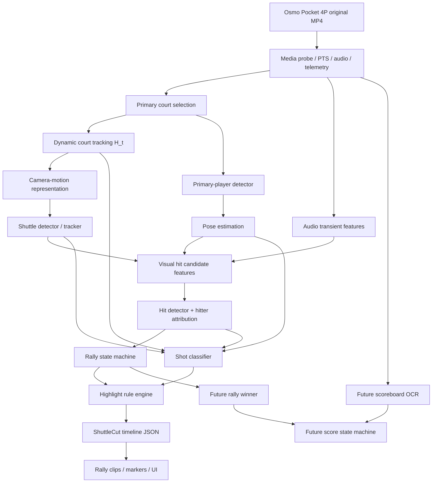
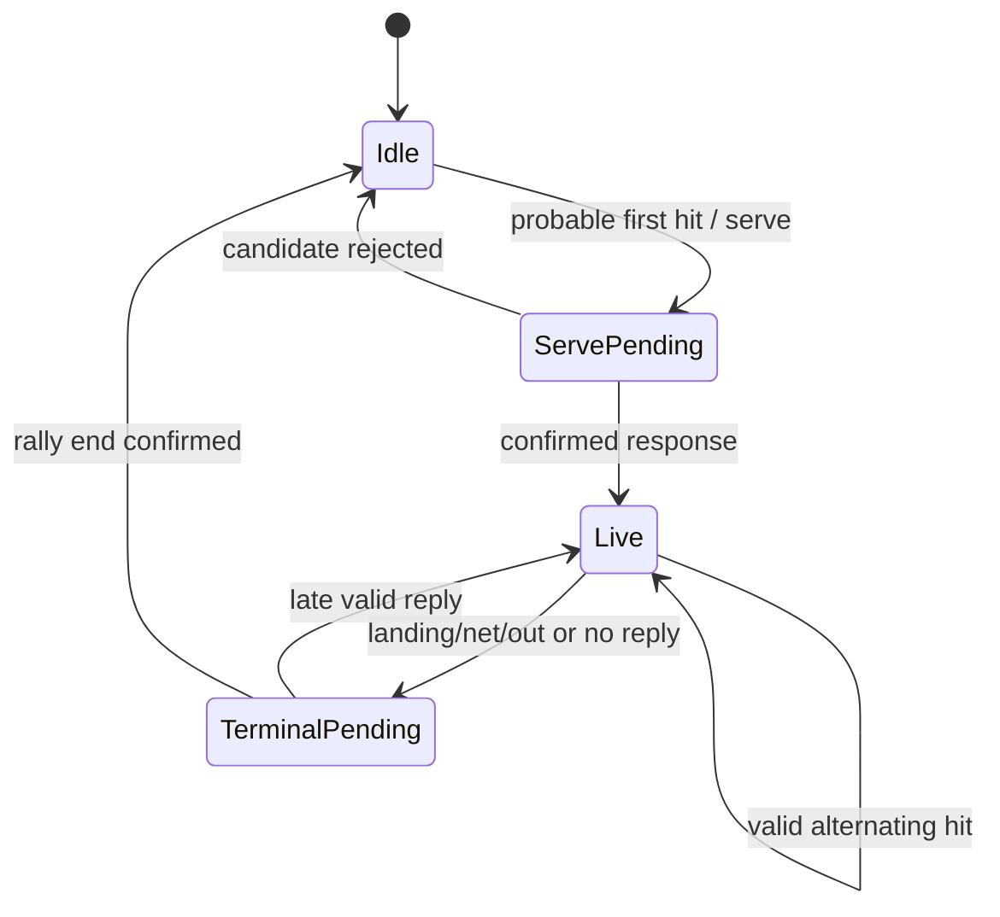
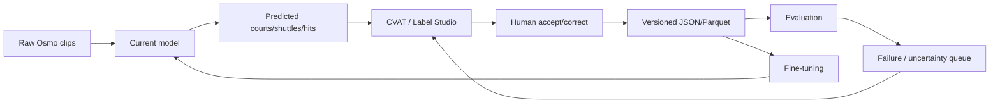
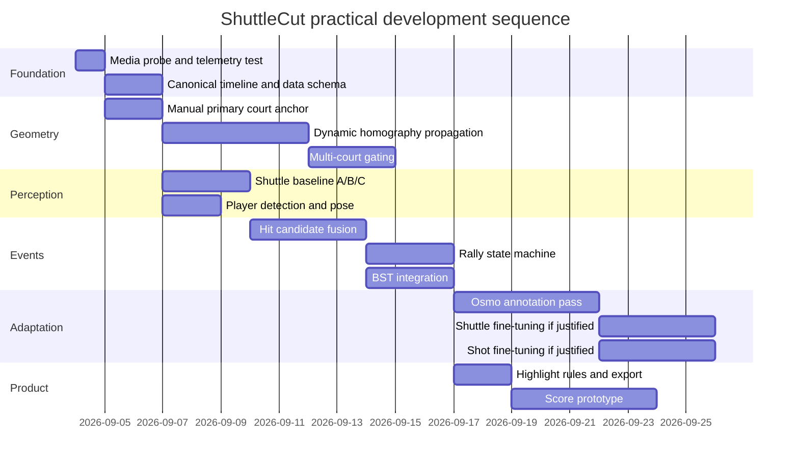

# ShuttleCut: A Practical Architecture for Rally Segmentation, Hit Detection, and Shot Classification from Moving Osmo Pocket Video

> 外部调研报告(用户提供,ChatGPT 生成,2026-09-03)。结论性建议:不训练单体模型,构建"主球场锚定 + 球轨迹 + 击球事件流 + 回合状态机"的模块化管线;域适应仅在实测证明必要时进行。

## Executive summary

After reviewing the recent badminton-computer-vision literature, current open-source implementations, newer 2025–2026 datasets, and moving-camera shuttlecock work, my recommendation is **not** to train a monolithic "badminton understanding model" from scratch.

A practical ShuttleCut should instead be built as a **modular perception-and-event pipeline**, with your own Osmo Pocket 4P data used for **domain adaptation only where measurements show that adaptation is necessary**.

The most important finding of this deeper review is that your problem differs substantially from the benchmark setting used by most existing badminton research. TrackNetV3 was designed for **broadcast badminton video**, ShuttleSet consists of structured records from professional singles matches, BST is evaluated on broadcast-derived data, BFMD contains broadcast matches, and the actively developed `badminton_cv_annotator` explicitly states that its court-detection path is currently validated on standard fixed-camera broadcasts and does **not** claim support for general amateur footage.

That means the main research problem for ShuttleCut is **not initially "how do I classify a smash?"** It is:

> **How do I establish a stable representation of one selected badminton court while the camera pans/tilts, keep unrelated courts and people out of the analysis, and then recover a reliable shuttle–player interaction timeline?**

Once that timeline exists, rally segmentation and highlights become comparatively easy.

My recommended architecture is therefore:



The strongest current open-source building blocks are:

**TrackNetV3 / BadmintonTrackNet** for shuttle tracking and trajectory repair; **BST** as the best direct starting point for stroke classification; **BFMD** as the best current reference for hierarchical full-match annotation and court/hit/rally structure; **ShuttleSet** as useful stroke-level supervision; **Badminton-hit-detection** as a particularly relevant design reference for combining shuttle, pose, and court-domain features; and the 2026 ETH Zurich **One-Shot Badminton Shuttle Detection for Mobile Robots** work as the most relevant published result I found for shuttle detection under genuinely moving viewpoints.

The second major finding is that **camera homography must be used carefully**. A time-varying homography \(H_t\) is excellent for mapping the **court plane** and approximately the players' foot positions into canonical court coordinates. It does **not** turn an airborne shuttlecock into true \((X,Y)\) court coordinates, because the shuttle is usually above the plane. Full shuttle 3-D reconstruction requires additional geometric assumptions, which is why work such as MonoTrack is substantially more involved than simple court rectification.

Therefore:

\[
\text{court point }p_t
\quad\Rightarrow\quad
P_{\text{court}}\sim H_t p_t
\]

is geometrically meaningful, whereas

\[
H_t p_{\text{shuttle}}
\]

should initially be treated only as a **camera-motion-normalized feature**, not as the shuttle's true metric world coordinate.

The third important result concerns Pocket 4P telemetry. DJI confirms that Pocket 4P records MP4/HEVC, has a dual-camera system, and supports up to 4K/240-fps slow motion. However, as of the current Gyroflow/`telemetry-parser` support information I found, DJI support lists devices such as recent Osmo Action, Avata, O3/O4 and Neo families but does **not yet list Pocket 4P as a supported camera**. That does **not prove that the Pocket 4P MP4 contains no gyro/gimbal metadata**; it only means we should treat telemetry as an experiment, not an architectural dependency.

The practical strategy is therefore:

> **Build a visual-only system that works without DJI telemetry; consume gyro/gimbal telemetry as an optional motion prior if the original MP4 turns out to contain usable synchronized data.**

Finally, your two development machines are sufficient for a serious prototype. I would use the Mac mini M4 primarily for development, FFmpeg/OpenCV preprocessing, visualization, annotation, and light MPS inference, while the RTX 2070 machine is the canonical CUDA machine for TrackNet, pose inference, and fine-tuning. The current BadmintonTrackNet fork explicitly supports `cpu`, `cuda`, and `mps`, although the original TrackNetV3 environment is much older.

My estimated path to a credible prototype is roughly **three to five focused development weeks for one engineer**, not counting large-scale manual annotation. Crucially, the first decision point can be reached in **half a day to one day** without training anything.

## Evidence base and open-source landscape

The table below separates what each project actually solves from what it appears, at first glance, to solve. "Moving-camera robustness" here means continuous handheld/gimbal camera motion, not merely a different fixed camera angle.

| Project / paper | Actual scope and I/O | Moving-camera evidence | Annotation needed to adapt | License / maturity | Recommended ShuttleCut role |
|---|---|---|---|---|---|
| **TrackNetV3** | Multi-frame shuttle localisation plus InpaintNet trajectory rectification. Outputs frame-wise visibility and pixel coordinates. Its reported test F1 is 98.56% on the Shuttlecock Trajectory Dataset. | **Low / unproven.** Paper explicitly targets broadcast badminton and uses an estimated background as auxiliary information; continuous gimbal motion is a domain shift. | `frame, visibility, x, y` for fine-tuning. | MIT in current repository; mature research baseline, roughly 300 GitHub stars at current crawl. | **Primary temporal shuttle baseline.** Benchmark raw vs camera-stabilized input before retraining. |
| **BadmintonTrackNet** | Modern TrackNetV3-derived toolkit adding trajectory repair, landing/hit/out-of-frame rules, BounceNet, evaluation, semi-automatic labeling and visualization. | **Low unless pre-stabilized.** Its event stages deliberately keep coordinates in original video pixels, so gimbal movement can masquerade as shuttle acceleration/direction change. | Shuttle coordinates plus corrected candidate event labels. Semi-auto tooling included. | MIT; active engineering fork with 100+ commits at current crawl. | **Best project to clone first** for engineering scaffolding, inference, correction UI concepts and event candidate generation. Do not trust raw-pixel hit heuristics before camera compensation. |
| **Badminton-hit-detection** | Court + pose + shuttle-domain features over 14-frame sequences fed to a GRU; predicts no-hit / near-player hit / far-player hit. | **Medium for viewpoint variation, unproven for active motion.** Trained on professional singles; authors report some generalization to amateur singles/doubles, camera angles and skill levels. | Hit timestamps, court/player/shuttle features; repository includes professional and amateur labeled material and labeling scripts. | Small research/notebook project; no clear repository license surfaced in the current review, so code reuse should be treated cautiously. | **Very important architectural reference.** Reimplement the idea as a modern temporal feature model rather than treating the notebook as production code. |
| **BST — Badminton Stroke-type Transformer** | CVPR Workshops 2026 stroke classifier using player pose, shuttle trajectory and player court position. Pretrained ShuttleSet/BadmintonDB/TenniSet weights are published. | **Low / untested.** Inputs come from broadcast-derived clips. Court-normalized player position helps, but shuttle coordinates are normalized by image resolution rather than fully camera-motion invariant. | Hit-centered stroke clips plus shot label; pose/shuttle/court features can be generated automatically. | MIT; peer-reviewed CVPRW 2026 official implementation. | **First shot classifier to benchmark.** Collapse its fine taxonomy to a smaller ShuttleCut taxonomy, then fine-tune on your videos. |
| **BFMD** | Full-match hierarchical data: match/rally intervals, hit events, shot types, shuttle tracks, player boxes/pose, courts, scores and captions. Paper reports 19 matches, >20 h, 1,687 rallies and 16,751 hit events. | Broadcast, not handheld. However it is particularly useful because it contains `court_perframe` data and explicitly handles changing camera geometry rather than assuming one immutable court calibration. | It **is** supervision rather than a deployable detector. BFMD annotations were produced with manual temporal annotation plus automated vision primitives. | CVPRW 2026 dataset/code. Current repo root does not expose a clear top-level license file; videos are not redistributed because of copyright. | **Best annotation/schema reference** and a strong source of broadcast pretraining/evaluation data. Copy its data concepts, not its camera assumptions. |
| **ShuttleSet** | Structured stroke-level singles dataset: 44 matches, 104 sets, 3,685 rallies and 36,492 strokes, with 18 stroke classes and player/hitting locations. | **None for handheld video.** It is chiefly stroke-level structured professional-match data rather than dense moving-camera pixel supervision. | Already annotated. Useful for shot taxonomy and stroke/rally sequence learning. | KDD 2023, well-established research dataset. Dataset/video redistribution terms should be checked separately from code licenses. | **Pretraining/taxonomy source**, especially for BST; not a camera-motion benchmark. |
| **badminton_cv_annotator** | End-to-end research/dataset-builder combining shuttle, pose, court evidence, contact detection, stroke classification and rally assembly; current production run processed all 40 eligible ShuttleSet videos into 3,527 rally records. | **Explicitly not ready for your domain.** Maintainers state CourtKeyNet/classical court paths have measured support on standard fixed-camera broadcasts and tested amateur footage failed closed. | Human-reviewed timelines plus generated vision artifacts; extensive regression/evaluation infrastructure. | LGPL-3.0-or-later; highly active 2026 engineering project. | **Read extensively for production architecture, testing, resumability and failure handling.** Do not assume its court/contact numbers transfer to Osmo footage. |
| **Gyroflow / telemetry-parser** | Parses embedded gyro/camera telemetry for supported devices and feeds stabilization pipelines. `telemetry-parser` can inspect/dump metadata. | Pocket 4P is **not in the current supported DJI model list I found**, so direct support is unknown rather than confirmed absent. | None if format supported; otherwise reverse engineering required. | Parser uses permissive Apache-2.0/MIT terms in current repo. | **Probe tool only initially.** Never make ShuttleCut depend on it until an original Pocket 4P file proves usable telemetry exists. |
| **One-Shot Badminton Shuttle Detection for Mobile Robots** | YOLOv8-derived single-frame shuttle detector trained on 20,510 frames across 11 backgrounds specifically for a moving robotic viewpoint. Reported F1 is 0.86 on similar environments and 0.70 on unseen environments under the authors' task metric. | **High relevance.** It is the strongest direct evidence I found for shuttle detection from non-stationary cameras. | Bounding boxes; repository contains an automatic-label → CVAT correction workflow. | AGPL-3.0 because of its YOLOv8 dependency; current repository is young. | **Essential A/B benchmark against TrackNetV3** and excellent autolabeling methodology. License matters if ShuttleCut later becomes proprietary. |
| **MonoTrack** | End-to-end court detection, pose, modified TrackNet and 2-D/3-D shuttle trajectory reconstruction from monocular broadcast badminton. | Broadcast-style, not moving handheld. | Substantial geometric/calibration supervision and pipeline components. | Adobe Research License, explicitly noncommercial research only. | **Geometry reference only.** Useful for understanding what is required to move from image trajectory to actual physical trajectory. |

A few newer research directions also deserve attention.

**FineBadminton**, published at ACM Multimedia 2025, introduced a richer multi-level badminton video understanding dataset, while the 2026 DSTA/Fine-Badminton temporal-localization work contains 31 professional matches, 2,104 rallies, 27,597 actions and 29 fine-grained stroke categories. These are relevant if ShuttleCut eventually attempts direct temporal action localization from RGB, but that is not where I would begin because both remain professional-video-centered.

The **One-Shot Badminton Shuttle Detection for Mobile Robots** paper is unusually important for your use case precisely because it breaks with the usual fixed-broadcast assumption. Its authors also found performance to be strongly dependent on shuttle size and background complexity, which matches the two problems your Osmo footage is likely to expose: a very small far-court shuttle and visually busy multi-court gym backgrounds.

For hit detection, cross-sport evidence is useful. The CVPR Workshops 2024 padel paper by Decorte et al. combines audio hit detection with positional analysis and reports an average hit-detection F1 of 92%, plus 83.7% player-specific hit attribution. Padel is not badminton and those numbers should not be transferred to ShuttleCut, but the result is strong evidence that **audio deserves to be a first-class auxiliary modality rather than an afterthought** in racket-sport hit detection.

There is also a 2023 badminton-specific hit-frame project that combines player/court keypoints and a transformer-based direction-sequence model. Its repository and preprint are worth reading, but I would rank it behind the domain-feature GRU and the newer multimodal evidence because its deployment assumptions remain close to broadcast analysis.

The conclusion from this evidence is fairly strong:

**Use existing models as sensors; build ShuttleCut's value in the fusion, court anchoring, domain adaptation and temporal logic.**

## Recommended ShuttleCut architecture

The pipeline should be designed around a canonical event model rather than around a specific neural network.

A useful internal data contract would look roughly like:

```json
{
  "video_id": "2026-09-03-session-a",
  "time_base": "video_pts",
  "primary_court": {
    "court_id": 0
  },
  "rallies": [
    {
      "start_s": 123.420,
      "end_s": 138.716,
      "hits": [
        {
          "time_s": 124.031,
          "player": "near_0",
          "shot": "serve",
          "shot_conf": 0.94
        },
        {
          "time_s": 125.412,
          "player": "far_0",
          "shot": "clear",
          "shot_conf": 0.78
        },
        {
          "time_s": 126.577,
          "player": "near_0",
          "shot": "smash",
          "shot_conf": 0.91
        }
      ],
      "tags": ["multi_shot", "smash"],
      "quality": {
        "court_conf": 0.97,
        "hit_coverage": 0.93
      }
    }
  ]
}
```

### Media ingestion and timebase

Do **not** make `frame_index / nominal_fps` the authoritative clock. Use video presentation timestamps from FFmpeg/PyAV. `ffprobe` can expose streams, packets, frames, PTS values, data streams and container metadata in structured formats.

This matters because hit timing, audio synchronization, slow-motion footage and future telemetry alignment all depend on one consistent clock.

Your original Pocket 4P files should stay immutable. DJI states that Pocket 4P records MP4/HEVC; its dual-lens system and substantial zoom range also mean ShuttleCut should record focal/lens mode when available and **reset court calibration when a lens switch or obvious focal-length jump occurs**.

For the MVP, I strongly recommend recording experiments with **one lens and no zoom changes during a rally**. Pan and tilt are fine; lens switching is much harder because camera intrinsics change abruptly.

Create a 1080p analysis proxy while retaining original temporal resolution. Do not destroy frames simply to reduce compute. A 4K source can be decoded to 1080p for most CV stages while the original remains available for high-resolution shuttle crops.

### Primary-court selection and moving-camera calibration

This is where I would intentionally use a small amount of human interaction in version one.

Instead of trying to make your first release infer which of five adjacent courts you care about, let the user select the primary court once:

```text
first usable frame

click:
    back-left
    back-right
    front-right
    front-left
```

or select a detected court proposal.

That single UX decision removes a large amount of uncertainty and makes a deployable system much easier.

Represent a canonical badminton court as a planar geometry model. At frame \(t\),

\[
\mathbf X_{\text{court}}
\sim
H_t\mathbf x_{\text{image}}
\]

where \(H_t\) is the image-to-court-plane homography.

Do **not** independently redetect \(H_t\) from scratch on every frame. That will jitter and fail under partial visibility.

A more robust implementation is:

```text
Absolute court keyframe
        |
        v
court lines / corners ---> H_k
        |
        v
track floor features between frames
        |
        v
RANSAC inter-frame planar transform
        |
        v
H_t propagation
        |
        +---- confidence drop?
                       |
                       v
               redetect/re-anchor
```

BFMD provides an especially useful blueprint here. Its current dataset documentation includes `court_perframe` annotations and a court-repair pipeline based on white-line masks, Hough-line hypotheses, vanishing-point families, matching against badminton-court geometry, homography scoring and geometric refinement.

For ShuttleCut I would simplify that initially:

1. At a high-confidence keyframe, fit the court geometry.
2. Track Shi–Tomasi/ORB or similar floor features with KLT optical flow.
3. Mask player regions before fitting motion.
4. Estimate the planar transform with RANSAC.
5. Propagate the four projected canonical court corners.
6. Smooth the **corners**, rather than independently smoothing the eight raw homography coefficients.
7. Recompute an absolute court solution whenever reprojection residual, inlier count or geometry validity deteriorates.

Useful geometry guards include convexity, plausible line ordering, court aspect consistency, non-crossing sidelines, minimum visible area and temporal continuity.

This matters more than sophisticated neural court detection in the first prototype. `badminton_cv_annotator`'s current results are instructive: its CourtKeyNet/classical path is intentionally limited to fixed broadcast footage and its authors say tested amateur footage failed closed.

A manual correction every thirty seconds is far preferable, initially, to an "automatic" system that silently jumps to the court next door.

**Important geometric correction:** the court plane and airborne shuttle are different objects.

Player foot midpoints are approximately on the plane, so:

\[
H_t p_{\text{feet}}
\]

is meaningful as a court-position feature.

The shuttle is typically not on that plane, so:

\[
H_t p_{\text{shuttle}}
\]

must **not** initially be interpreted as a true shuttle landing-plane coordinate.

For the shuttle, maintain three coordinate representations:

```text
raw pixel:
(u, v)

camera-stabilized pixel:
(u_s, v_s)

optional pseudo-court projection:
H_t (u, v)
```

The last is useful as a feature, but not as metric physics. MonoTrack's considerably more involved 3-D reconstruction pipeline is a useful reference for why monocular physical shuttle reconstruction requires more geometry than planar court rectification.

### Ignoring secondary courts and irrelevant people

Once the primary court exists, this becomes much easier than "detect all badminton players in the gym."

For each detected person's footpoint:

\[
q_i = H_t p^{(i)}_{\text{feet}}
\]

then evaluate whether \(q_i\) lies inside or near the canonical primary court.

The logic should be temporal:

```text
person candidate
   |
inside selected court?
   |
persistent 0.5–1 s?
   |
reasonable player motion?
   |
assigned near/far half?
   |
ACTIVE PLAYER
```

For singles, the normal target state is one persistent active player on each half. For doubles it is two. Do not hard-code that as an absolute detector rule; use it as a strong prior.

Secondary-court players will usually fail court membership even when their image bounding boxes overlap your scene.

Shuttle gating needs to be softer because airborne shuttle projections can fall outside the floor polygon. I would retain shuttle candidates in an **expanded image-space primary-court envelope**, then score candidates using:

\[
S =
w_1 S_{\text{track continuity}}
+
w_2 S_{\text{player association}}
+
w_3 S_{\text{primary court proximity}}
+
w_4 S_{\text{motion plausibility}}
\]

rather than simply deleting everything outside the court polygon.

This is especially important in a gym containing several simultaneous games.

### Shuttle detection and trajectory

You should benchmark **three** variants before training.

**Variant A: raw TrackNetV3.**

This gives the most direct literature baseline. TrackNetV3's official repository reports 99.33% recall and 98.56% F1 on its own shuttlecock trajectory test split, but those numbers are from the target dataset and must not be treated as a prediction for Osmo video.

**Variant B: camera-stabilized TrackNetV3.**

TrackNetV3 explicitly uses an estimated background as auxiliary information. Continuous gimbal movement is therefore a reasonable source of domain mismatch.

Instead of warping to a full top-down court—which can destroy tiny far-court shuttle pixels—try a milder **reference-camera stabilization**:

\[
I_t^{stable}=W(I_t,G_{t\rightarrow ref})
\]

where \(G\) is the inter-frame/background planar motion.

Then run TrackNet in that stabilized image sequence.

This is an experiment, not something we can assume is superior: warping may improve temporal background consistency while interpolation may worsen a two-pixel shuttle. That is exactly why the raw/stabilized A/B test belongs on day one.

**Variant C: single-frame moving-camera detector.**

The 2026 ETH Zurich moving-robot paper is a particularly good comparator: it uses 20,510 frames from 11 backgrounds and reports meaningful performance under unseen backgrounds, specifically targeting non-stationary viewpoints.

Its repository even provides an autolabel → CVAT correction process, although its AGPL license needs consideration for commercial reuse.

Long term, I suspect the strongest architecture for your use case will be an **ensemble**:

```text
TrackNet temporal detector
        +
single-frame small-object detector
        +
trajectory continuity
        ↓
fused shuttle track
```

TrackNet handles temporal visual evidence and blurred trajectories. A single-frame detector can recover after camera motion or TrackNet background failure.

Fine-tune the shuttle model only after this A/B/C benchmark identifies the dominant failure mode.

### Players and pose

Use a person detector followed by a top-down pose estimator only for the active primary-court players.

MMPose is the obvious open-source starting point; it supports image/video inference and includes RTMPose-family models.

You do not need expensive whole-body estimation.

For hit and stroke reasoning, the most useful joints are roughly:

```text
shoulders
elbows
wrists
hips
knees
ankles
```

The feet support court coordinates; wrist/elbow/shoulder movement supports stroke timing.

BST's results are also a warning against over-engineering 3-D pose too early: its study found the 2-D pose representation competitive or superior to the tested 3-D alternative in that setup.

### Hit detection

This is where I would depart most from existing single-project implementations.

Do not make "shuttle acceleration sign changed" the production hit detector.

Instead build a high-recall candidate generator and a learned temporal fusion classifier.

For each possible hit around time \(t\), derive:

\[
f_t =
[
\text{shuttle position/history},
\text{camera-compensated motion},
\text{shuttle direction change},
\text{visibility gaps},
\text{distance to each wrist},
\text{wrist velocity},
\text{elbow/shoulder motion},
\text{player court position},
\text{audio features}
]
\]

and predict:

\[
P(\text{hit at }t)
\]

with a small GRU, TCN or transformer.

This is much closer to the philosophy of `Badminton-hit-detection`, where court, player pose and shuttle coordinates are converted into badminton-domain features and passed through a temporal GRU instead of asking an RGB image classifier to recognize "hit/not hit."

Audio should enter as a **soft cue**. The padel CVPRW work demonstrates that racket impacts can provide excellent hit-event information, but your multi-court gym introduces other people's racket sounds, so audio by itself would be dangerous.

A useful fusion is:

\[
P_{hit}
=
F(
P_{\text{shuttle}},
P_{\text{wrist}},
P_{\text{audio}},
P_{\text{sequence}}
)
\]

and then apply badminton constraints such as plausible player alternation.

I would separate:

```text
is there a hit?
```

from:

```text
who hit?
```

rather than learning one large multiclass problem.

After detecting a hit, hitter attribution can combine wrist distance, player pose activity, shuttle motion and court side.

Store the timestamp as the actual PTS at the event posterior maximum rather than merely storing a frame number.

### Rally segmentation

Do not train a rally transformer initially.

Once hits are reliable, a rally is naturally a temporal state machine.



This is substantially easier to debug than an end-to-end action-localization model.

Ground-truth rally definitions should be explicit. BFMD uses frame-level temporal annotation for rallies/hits and defines hit moments around player–shuttle contact; its hierarchy is a good reference for your annotation schema.

ShuttleCut should distinguish:

```text
rally_start
rally_end
```

from:

```text
clip_start = rally_start - padding
clip_end   = rally_end   + padding
```

so editing preferences do not contaminate the evaluation labels.

### Shot classification and highlights

For a first real version, I recommend this taxonomy:

| ShuttleCut class | Merge from richer datasets |
|---|---|
| `serve` | serve, flick serve |
| `clear` | clear |
| `drop` | drop |
| `smash` | smash |
| `drive` | drive |
| `lift` | lift/lob |
| `net` | net shot, net kill |
| `defense_other` | block, push, press, other/uncertain |

BFMD contains a richer set including serve, flick serve, clear, drop, smash, drive, net shot, net kill, lift, push, press and block, among others, making it useful for defining such mappings.

Why reduce the class count?

BST's published ShuttleSet configuration is a genuinely difficult fine-grained task. Its reported performance is around 0.77 accuracy and 0.70 macro-F1 in its 35-class setup, and the authors explicitly identify subtle class confusion plus dependence on good hit/shuttle detection as remaining problems.

Your application does not need to solve a harder taxonomy than the product requires.

Run pretrained BST first. Its repository shows exactly how its three main feature types are normalized:

- shuttle by video resolution;
- player joints relative to the player bounding box;
- foot midpoint projected to court coordinates and normalized to the court.

For ShuttleCut, I would modify the shuttle branch to include **camera-stabilized player-relative shuttle motion**, rather than trusting raw resolution-normalized coordinates from a moving camera.

The model input around a hit becomes approximately:

\[
[
\text{2-D pose},
\text{player-relative shuttle trajectory},
\text{stabilized shuttle trajectory},
\text{player court position}
]
\]

A later version could add a cropped RGB branch.

Highlights should deliberately remain outside the neural model:

```text
rally.hit_count >= threshold
    -> multi_shot

rally.duration >= threshold
    -> long_rally

any shot == smash && confidence > threshold
    -> smash

count(smash) >= 2
    -> multiple_smashes
```

Rather than hard-coding an arbitrary universal definition of "long rally," derive defaults from your own library:

\[
\text{long rally} =
\text{hit count} \ge P_{75}
\]

and

\[
\text{very long rally} =
\text{hit count} \ge P_{90}
\]

while allowing the user to configure thresholds.

That gives a much more stable product behavior than asking a classifier to learn the semantic label "exciting rally."

## Data, annotations, and evaluation

The most important dataset is ultimately **your own Osmo domain dataset**, but you should build it by correcting model output rather than labeling everything manually.

The public datasets each serve a different purpose:

| Dataset | Scale / annotations | Best use for ShuttleCut | Main limitation |
|---|---|---|---|
| **Shuttlecock Trajectory Dataset / TrackNet ecosystem** | Frame-wise shuttle visibility/x/y used by TrackNetV3. | Shuttle pretraining/baseline. | Mostly the traditional badminton-camera domain. |
| **ShuttleSet** | 44 matches, 3,685 rallies, 36,492 strokes, 18 shot classes plus positions. | Shot taxonomy, BST training, tactical sequence priors. | Professional singles structured records; not moving-camera pixel GT. |
| **BFMD** | 19 full broadcast matches, >20 h, 1,687 rallies, 16,751 hits; rally/hit/shot/pose/shuttle/court/score/caption hierarchy. | Best schema/template; hit/rally/shot supervision; court pipeline reference. | Broadcast domain; current public package documentation has some count inconsistencies that should be verified before building experiments around exact subsets. |
| **FineBadminton** | Multi-level fine-grained video understanding benchmark from ACM MM 2025. | Later fine-grained video/TAL experiments. | Professional video domain; overkill for MVP. |
| **Fine-Badminton / DSTA** | 31 matches, 2,104 rallies, 27,597 actions, 29 stroke categories. | Future direct temporal action localization. | 2026 research/preprint stage and professional match bias. |
| **Mobile-robot shuttle dataset** | 20,510 frames, 11 backgrounds, explicitly non-stationary viewpoint. | Moving-camera shuttle detector benchmark/pretraining ideas. | Robotics viewpoint is still not identical to a Pocket gimbal; repository is AGPL. |
| **Badminton-hit-detection amateur data** | Professional + amateur single/double hit labels and derived domain features. | Hit-event generalization experiments. | Small research project; licensing/maturity concerns. |

For your own data, I would not begin with thousands of rallies.

The **first serious Osmo benchmark** can be approximately:

```text
3–5 recording sessions
20–30 min useful playing time
100–200 rallies
~1,000–2,000 hit events
```

The critical rule is to split by **recording session**, not by random frame or random rally.

For example:

```text
session A -> train
session B -> train
session C -> validation
session D -> completely held-out test
```

Otherwise frames from the same gym, exposure, camera trajectory and players will leak into train/test and produce misleadingly good numbers.

The minimum annotation schema should be:

| Object | What to label manually | What not to label initially |
|---|---|---|
| Court | Four or more canonical intersections on sparse failure/key frames; primary-court ID | Every line every frame |
| Shuttle | Point/bbox + visibility on selected evaluation/failure frames | Every frame of every recording |
| Player | Correct active-player IDs when tracker fails | Full person boxes on all frames |
| Hit | Precise PTS/frame, hitter identity/side | Full action clip boundaries |
| Shot | Coarse shot class at matched hit | 20–30 subtle classes |
| Rally | First-hit/serve time, last-event time | Artificial edit padding |
| Terminal event | landing/net/out/unknown when useful | Fine-grained fault taxonomy initially |
| Score | Optional score state / winner later | OCR annotations before score work begins |

A practical semi-automatic annotation loop is:



This pattern is directly supported by precedent: BFMD used Label Studio for temporal/visual annotation, BadmintonTrackNet includes semi-automatic candidate correction tools, and the moving-camera shuttle detector exports automatic labels for correction in CVAT.

I would implement a few very small ShuttleCut-specific scripts rather than immediately building a large annotation application:

```text
tools/
  probe_media.py
  select_primary_court.py
  track_court.py
  run_shuttle_baselines.py
  generate_hit_candidates.py
  export_cvat.py
  import_cvat.py
  export_labelstudio.py
  evaluate_court.py
  evaluate_shuttle.py
  evaluate_hits.py
  evaluate_rallies.py
  evaluate_shots.py
```

Store every derived result with model/version provenance:

```json
{
  "source_video_sha256": "...",
  "model": "tracknetv3",
  "checkpoint": "...",
  "pipeline_version": "0.2.1",
  "generated_at": "...",
  "predictions": []
}
```

That will save a lot of pain once you start re-running twenty-minute videos with different court stabilization variants.

The evaluation protocol should be modular.

| Module | Primary metric | Secondary diagnostics |
|---|---|---|
| Court | normalized keypoint/reprojection error; valid-frame coverage | P95 pixel error, number of primary-court identity switches, redetection count |
| Shuttle | visible-frame precision/recall/F1 at a spatial tolerance | track-gap length distribution, false tracks from secondary courts |
| Hit | event precision/recall/F1 at ±50 ms and ±100 ms | median absolute timestamp error, hitter-attribution accuracy |
| Rally | rally detection F1 | start/end MAE, temporal IoU, fraction within ±250 ms |
| Shot | macro-F1 | per-class precision/recall, confusion matrix, top-2 accuracy |
| Highlight | rally-level precision/recall | false highlight cause |
| Score later | exact score-state accuracy | correction recovery, winner accuracy |

Use **time tolerances rather than frame tolerances** for hits. Four frames at 120 fps and two frames at 60 fps are approximately the same temporal error; frame-based evaluation would make those incomparable.

For TrackNet-style shuttle evaluation, retain a spatial metric too, but evaluate separately on:

```text
easy visible shuttle
motion-blurred shuttle
occluded shuttle
far-court tiny shuttle
large camera motion
secondary-court interference
```

A single overall F1 can otherwise hide the exact problem you need to fix.

I would use these as **engineering success gates**, not literature claims:

| Milestone | Proposed gate |
|---|---:|
| Dynamic primary court | ≥95% valid frames on benchmark clips; zero wrong-court switches |
| Court reprojection | P95 ≲10 px at 1080p on manually checked court features |
| Initial shuttle baseline | ≥80% recall overall; ≥90% on clearly visible shuttle frames |
| Hit candidate generator | ≥90% recall within ±100 ms, even if precision is initially only ~50% |
| Usable hit detector | F1 ≥0.85 at ±100 ms |
| MVP rally segmentation | F1 ≥0.90; matched boundaries usually within ±250 ms |
| Smash highlight | precision and recall each ≥0.85 on held-out session |
| Coarse shot classifier | macro-F1 ≥0.75 as an initial deployability threshold |

Those are project targets. They are deliberately not presented as guaranteed outcomes.

## Implementation plan and hardware

Your hardware changes what I would optimize, but it does not block the project.

**Mac mini M4 / 16 GB**

Use it as the primary development workstation:

```text
Java / backend work if desired
Python orchestration
FFmpeg / PyAV
OpenCV
court tracking and homography
annotation frontend/backend
JSON/Parquet/DuckDB
visualization
light MPS inference
```

The current BadmintonTrackNet explicitly exposes `mps` as a device option.

I would nevertheless avoid making Apple MPS compatibility a requirement for every third-party model, because older TrackNet/OpenMMLab dependencies were developed primarily around Linux/CUDA.

**Razer Blade 15 / i7 / RTX 2070 Max-Q / 32 GB**

Make this the canonical ML machine:

```text
Windows
  └── preferably WSL2 Ubuntu for research repos
       ├── NVIDIA CUDA
       ├── PyTorch
       ├── TrackNet env
       ├── OpenMMLab env
       └── BST env
```

Before choosing batch sizes, check actual VRAM with:

```bash
nvidia-smi
```

That is the pattern I would follow everywhere:

```text
FP16 / AMP
batch size 1–4 where necessary
crop to primary court
1080p proxy
pose only for active players
pose densely only around relevant windows
```

Do not send the entire 4K frame into every model.

A sensible data path is:

```text
Pocket 4P original HEVC MP4
            |
            +--> archive untouched
            |
            +--> 1080p temporal-preserving proxy
                        |
                        +--> court
                        +--> shuttle
                        +--> person
                        |
                        +--> candidate hits
                                  |
                        +--> return to original resolution
                             only for uncertain local crops
```

For capture settings, **4K/60 in an ordinary video mode is a very sensible starting experiment** because it preserves good temporal resolution without immediately introducing the special semantics of 100/120/200/240-fps slow-motion recording.

The implementation order matters more than the model choice.



These are my engineering estimates for a solo developer:

| Work item | Estimated engineering effort | Train first? |
|---|---:|---|
| Media/PTS/telemetry probe | 0.5–1 person-day | No |
| Proxy generation + data contract | 1–2 days | No |
| Manual primary-court selection | 1–2 days | No |
| Basic dynamic \(H_t\) propagation | 2–4 days | No |
| Robust auto re-detection/re-anchoring | +5–10 days | No |
| Secondary-court/player filtering | 2–4 days | No |
| TrackNetV3/BadmintonTrackNet integration | 1–2 days | No |
| Moving-camera detector A/B benchmark | 1–2 days | No |
| Osmo shuttle fine-tuning | 2–5 engineering days + 2–5 labeling days | **Only if baseline fails** |
| Active-player detector + pose | 1–3 days | Usually no |
| Multimodal hit detector baseline | 3–6 days | Small temporal model only |
| Rally FSM | 2–3 days | No |
| BST integration | 2–4 days | No |
| Coarse BST Osmo adaptation | 3–6 engineering days + labeling | Probably eventually |
| Highlight engine | 1–2 days | No |
| Physical/overlay score OCR prototype | 3–7 days | Maybe OCR fine-tune |
| Score inference without visible scoreboard | 7–15+ days | Likely models + rules |
| End-to-end UI/export/polish | 5–10 days | No |

Notice what the table says: **the dynamic court module is at least as important an engineering investment as fine-tuning TrackNet**, and probably more important initially.

A good repository layout would be:

```text
shuttlecut/
├── apps/
│   ├── annotator/
│   └── viewer/
├── src/
│   └── shuttlecut/
│       ├── media/
│       ├── telemetry/
│       ├── court/
│       ├── camera_motion/
│       ├── shuttle/
│       ├── players/
│       ├── pose/
│       ├── hits/
│       ├── rallies/
│       ├── shots/
│       ├── highlights/
│       ├── score/
│       └── evaluation/
├── third_party/
├── configs/
├── models/
├── datasets/
│   ├── raw/
│   ├── annotations/
│   └── derived/
└── tests/
```

Keep third-party model wrappers outside your core domain model. That will let you replace TrackNet with another shuttle detector without rewriting rally logic.

## Telemetry, failure modes, and score extension

Pocket 4P telemetry should be treated as **an optional acceleration path**.

DJI's product documentation establishes the camera format and hardware characteristics, but I found no official documentation saying that user-recorded Pocket 4P MP4 files expose synchronized gimbal yaw/pitch/roll or IMU samples for third-party use. Current Gyroflow parser support also does not establish Pocket 4P support.

So run a real experiment on an **untouched camera-original file**.

Start with:

```bash
ffprobe \
  -hide_banner \
  -show_format \
  -show_streams \
  -show_programs \
  -show_chapters \
  -of json \
  DJI_ORIGINAL.MP4 > ffprobe.json
```

Then explicitly look for data streams:

```bash
ffprobe \
  -v error \
  -show_entries \
  stream=index,codec_type,codec_name,codec_tag_string,time_base,duration:stream_tags \
  -of json \
  DJI_ORIGINAL.MP4
```

Then:

```bash
ffprobe \
  -v error \
  -select_streams d \
  -show_packets \
  -show_data \
  DJI_ORIGINAL.MP4 > data_packets.txt
```

Run ExifTool recursively over embedded metadata:

```bash
exiftool \
  -ee \
  -G3 \
  -a \
  -u \
  -api LargeFileSupport=1 \
  DJI_ORIGINAL.MP4 > exiftool.txt
```

Search the results for candidate data such as:

```text
gyro
gyroscope
accelerometer
quaternion
orientation
yaw
pitch
roll
gimbal
djmd
dbgi
dvtm
```

Those DJI/private names are investigation targets, not a claim that Pocket 4P necessarily contains them.

The outcome produces architectural branches.

| MP4 result | ShuttleCut action |
|---|---|
| **Time-synchronized orientation/gyro successfully decoded** | Resample telemetry against video PTS; use rotation as a high-rate camera-motion prior. Still solve court \(H_t\) visually. |
| **Raw gyro exists but absolute camera attitude does not** | Estimate inter-frame rotation after bias handling; use it to initialize visual feature matching/stabilization. |
| **Unknown private binary metadata exists** | Save it and investigate separately, but continue visual implementation in parallel. Do not block project. |
| **No useful telemetry exists** | Pure visual dynamic-court / optical-flow solution; no architectural change required. |

Even perfect gimbal yaw/pitch/roll would **not** eliminate court calibration. Gimbal motor angles are not identical to complete camera world pose, and projective motion also depends on camera intrinsics and viewpoint; handheld translation can introduce effects that a rotational angle alone does not model.

That is why the correct relationship is:

```text
telemetry = prior

court geometry = observable constraint

visual feature motion = correction
```

rather than:

```text
gimbal yaw/pitch -> exact court H
```

There are several other high-risk failure modes.

| Risk | Why it matters | Mitigation |
|---|---|---|
| **Gimbal pan/tilt** | TrackNet's temporal/background assumptions can be violated. | Reference-frame stabilization; short-window background estimation; moving-camera detector ensemble. |
| **Multiple courts** | Secondary shuttles are visually indistinguishable objects. | Primary-court identity, active-player association, temporal candidate gating. |
| **Tiny far-court shuttle** | Single-frame detector recall falls as object size decreases; moving-camera study identifies shuttle size/background complexity as major factors. | Preserve resolution; primary-court crop; temporal TrackNet; fine-tune hard examples. |
| **Player/shuttle occlusion** | Shuttle disappears near player body exactly around important hit events. | Inpaint/trajectory repair plus pose/audio evidence; TrackNetV3 was explicitly designed to rectify trajectory gaps. |
| **Other courts' impact sounds** | Audio generates false hit candidates. | Never accept audio-only events; require visual/player temporal consistency. |
| **AV timing error** | A 100-ms offset destroys useful impact fusion. | Use PTS; estimate constant offset from visually obvious hits if necessary. |
| **Lens/zoom switch** | Intrinsics and court geometry jump. Pocket 4P supports wide and 60-mm cameras and substantial zoom. | MVP: lock lens/zoom. Production: detect discontinuity and start a new calibration segment. |
| **Shot ambiguity** | Clear/drop/lift/block can share pose patterns. BST itself reports confusion among subtle categories. | Coarse taxonomy; use trajectory/context; report uncertainty. |
| **Research-code licensing** | Some of the most useful repos are AGPL, LGPL, noncommercial or lack clear licensing. | Keep conceptual references separate from distributable code; review licenses before commercial productization. |

Score recognition should be architected as an extension of the event timeline, not buried inside the CV pipeline.

There are actually three different score problems.

**Visible electronic/physical scoreboard**

```text
primary scoreboard detector
          ↓
track ROI across camera motion
          ↓
perspective rectify
          ↓
OCR
          ↓
temporal consensus
          ↓
rules-aware score state
```

A score should not change because OCR briefly reads `15` as `16`. Maintain a temporal state and require a legal transition.

**Broadcast-style on-screen graphic**

This is easier because the graphic is typically screen-fixed, so camera motion does not affect the ROI. An OCR engine plus template/field detector can solve it.

**No scoreboard visible**

Then score recognition becomes:

```text
rally segmentation
      ↓
rally winner / fault outcome
      ↓
rules-aware state machine
      ↓
score
```

That is a significantly harder research problem because rally winner determination must distinguish landing in/out, net faults and other terminal outcomes. I would defer it until hit and rally accuracy are already strong.

## Minimal reproducible experiment

Before writing another major model, I would run the following experiment. It is intentionally designed to fit into roughly **half a day to one day**.

Prepare three untouched Pocket 4P clips:

| Clip | Duration | Desired property |
|---|---:|---|
| A | 60–120 s | little gimbal movement |
| B | 60–120 s | moderate pan/tilt |
| C | 60–120 s | aggressive camera movement and preferably adjacent courts |

Ideally they contain approximately 50–150 total hits.

**First, probe the actual MP4.**

Run the ffprobe/ExifTool/Gyroflow commands above and record:

```text
codec
actual PTS
avg_frame_rate
r_frame_rate
time_base
audio streams
data streams
metadata tracks
candidate DJI telemetry
```

Success here is binary: either synchronized usable telemetry exists, or ShuttleCut continues visual-only.

**Second, manually establish the primary court.**

For each clip, click four or more court intersections on the first high-quality frame.

Implement basic optical-flow/RANSAC propagation of those projected court corners.

Manually inspect roughly 100 sampled frames.

The experiment passes if:

```text
primary court identity switch count = 0
valid calibration coverage >= 95%
P95 court feature error ~ <= 10 px at 1080p
```

**Third, run shuttle A/B/C.**

```text
A: raw TrackNetV3 / BadmintonTrackNet

B: stabilized TrackNetV3

C: moving-camera single-frame detector
```

Manually annotate approximately 300–500 evaluation frames, deliberately oversampling:

```text
hits
blurred shuttle
far court
camera pans
occlusion
secondary courts
```

Record separate recall for each bucket.

If raw TrackNet achieves:

```text
clear-frame recall >= 90%
overall recall >= 80%
```

there is no reason to retrain it immediately.

If stabilized TrackNet is dramatically better, camera compensation becomes the priority.

If the single-frame detector wins during gimbal motion, build a hybrid tracker.

If all three fail mostly when the shuttle is tiny, collect Osmo shuttle labels and fine-tune.

**Fourth, hand-mark hit timestamps.**

Do not classify shots yet.

Create:

```csv
time_s,hitter
12.384,near
13.472,far
14.291,near
...
```

Use shuttle trajectory + wrist motion + a crude audio transient score to generate high-recall candidates.

The first milestone is:

\[
Recall_{hit}@100ms \geq 0.90
\]

Precision may initially be mediocre. A high-recall candidate generator is much easier to refine than one that silently misses hits.

This single experiment tells us what needs training.

The decision matrix becomes:

| Result | Next investment |
|---|---|
| Court unstable, shuttle otherwise good | **Dynamic homography/court module** |
| Court stable, TrackNet poor everywhere | **Osmo shuttle fine-tuning** |
| Shuttle good, hit timing poor | **Pose/audio temporal hit model** |
| Hits good, rallies poor | **Rally state logic / terminal-event modeling** |
| Hits and rallies good, shot types poor | **BST fine-tuning** |
| Secondary courts dominate false positives | **Primary-court gating + player/shuttle association** |
| Everything good except aggressive pans | **Telemetry-assisted/visual stabilization** |

That is a much more efficient development loop than deciding today to train a new network.

## Papers and repositories to read and clone

**TrackNetV3 — "Enhancing ShuttleCock Tracking with Augmentations and Trajectory Rectification," ACM Multimedia Asia 2023.** It defines the current mainstream TrackNet baseline and, equally importantly, exposes why background-dependent temporal localization may have difficulties under continuous camera motion.

**ShuttleSet — "A Human-Annotated Stroke-Level Singles Dataset for Badminton Tactical Analysis," KDD 2023.** It establishes a widely used structured stroke taxonomy and provides 36,492 labeled strokes over 3,685 rallies.

**Automated Hit-frame Detection for Badminton Match Analysis, 2023.** Useful specifically for hit-frame reasoning and the relationship between court/player features and shuttle motion.

**Multi-Modal Hit Detection and Positional Analysis in Padel Competitions, CVPR Workshops 2024.** Not badminton, but arguably one of the most relevant papers for the design of ShuttleCut's audio/visual hit detector.

**FineBadminton, ACM Multimedia 2025.** Useful for the later-stage problem of richer tactical and fine-grained understanding, not for your first tracking baseline.

**BST — Badminton Stroke-type Transformer, CVPR Workshops 2026.** This should be the starting point for ShuttleCut's shot classifier.

**BFMD — A Full-Match Badminton Dense Dataset for Dense Shot Captioning, CVPR Workshops 2026.** Read its annotation structure and court-per-frame processing even if you have no interest in caption generation.

**One-Shot Badminton Shuttle Detection for Mobile Robots, 2026.** This is arguably the most important paper outside the classic TrackNet line for your specific camera problem.

**Decoupling Spatio-Temporal Adapter for Fine-Grained Badminton Action Localization, 2026.** Keep this for phase two or three.

**MonoTrack — Shuttle Trajectory Reconstruction from Monocular Badminton Video.** Read it specifically before attempting true 3-D shuttle reconstruction or physical shuttle speed/landing estimates.

For code, my first clone directory would be:

```bash
mkdir shuttlecut-research
cd shuttlecut-research

# Primary shuttle baseline
git clone https://github.com/ZSHYC/BadmintonTrackNet.git

# Original TrackNetV3 reference
git clone https://github.com/qaz812345/TrackNetV3.git

# Shot classification
git clone https://github.com/Va6lue/BST-Badminton-Stroke-type-Transformer.git

# Full-match annotation/data architecture
git clone https://github.com/Ning-D/BFMD.git

# Current end-to-end engineering reference
git clone https://github.com/ahalp90/badminton_cv_annotator.git

# Moving-camera shuttle research
git clone https://github.com/leggedrobotics/shuttle_detection.git

# Hit-detection design reference
git clone https://github.com/kwyoke/Badminton-hit-detection.git

# Geometry / 3-D research reference; noncommercial research license
git clone https://github.com/jhwang7628/monotrack.git

# Modern pose stack
git clone https://github.com/open-mmlab/mmpose.git
```

The resulting technical strategy is therefore:

> **Do not build "ShuttleCutNet." Build ShuttleCut as a court-anchored event system.**

The first production-quality primitive should be:

\[
\boxed{\text{selected primary court} + H_t + \text{stable timebase}}
\]

The second should be:

\[
\boxed{\text{high-recall shuttle track}}
\]

The third:

\[
\boxed{\text{high-recall, timestamp-accurate hit stream}}
\]

Only after those are trustworthy should you spend meaningful annotation effort on:

\[
\boxed{\text{BST shot-type adaptation}}
\]

and once those four pieces exist, the remainder of the first product becomes largely deterministic:

\[
\text{hits}
\rightarrow
\text{rallies}
\rightarrow
\text{shot labels}
\rightarrow
\text{multi-shot / long-rally / smash highlights}
\rightarrow
\text{clips and timeline markers}.
\]

The key first-day success criterion is therefore **not "recognize smashes."** It is to demonstrate, on low-, medium-, and high-motion Pocket 4P clips, that ShuttleCut can keep the correct court locked, determine whether visual stabilization materially improves shuttle tracking, and recover at least 90% of manually marked hit events within a ±100-ms candidate window.
